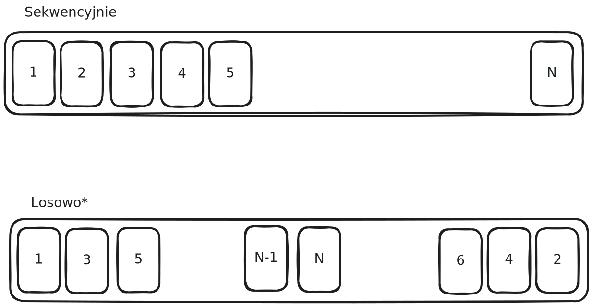

# Laboratorium 1 - Badanie sposobów odczytu pliku

- [Laboratorium 1 - Badanie sposobów odczytu pliku](#laboratorium-1---badanie-sposobów-odczytu-pliku)
  - [Strategie czytania pliku](#strategie-czytania-pliku)
  - [Operacja na wczytanych danych](#operacja-na-wczytanych-danych)
  - [Pomiar czasu](#pomiar-czasu)
  - [Różne technologie dyskowe](#różne-technologie-dyskowe)
  - [Materiały do przeczytania](#materiały-do-przeczytania)

Celem laboratorium jest zbadanie dwóch sposobów odczytu do pliku
* strumieniowe (`read(2)`),
* mapowanie pliku (`mmap(2)`).

Z perspektywy systemów DBMS interesuje nas szybkość zapisu oraz odczytu do pliku.
Twoim zadaniem jest przygotowanie programu, który zmierzy czas odczytu podanego przez użytkownika pliku.

Program napisany na tym projekcie zostanie porzucony w ramach kolejnego.
Zalecanym językiem do realizacji projektu jest język C.

## Strategie czytania pliku
Typowo dzieli się pliki na bloki stałego rozmiaru (np. 8M), aby ułatwić zarządzanie odczytanymi wcześniej częściami pliku.
Po takim podziale należy zaimplementować dwie strategie czytania plików:
* sekwencyjną
* losową (dla uproszczenia plik będzie czytany od tyłu i od przodu na zmianę).

Poniżej można zobaczyć wizualizacje czytania plików powyższymi strategiami w przypadku podzielenia pliku na bloki.

## Operacja na wczytanych danych

Aby upewnić się, że dane zostały wczytane prawidłowo program powinien wyliczyć hash MD5 z pliku wczytanego każdą strategią i sposobem.
Implementacja algorytmu jest poza zakresem tego laboratorium, więc można skorzystać z wybranej implementacji algorytmu z internetu (oczywiście proszę uważać na licencję!)

## Pomiar czasu
W ramach projektu interesuje nas pomiar czasu operacji wczytania całego pliku oraz obliczenia funkcji MD5.
Operacje tworzenia zasobów (otwierania pliku lub mapowania go do pamięci dzielonej) można pominąć.
Za pomocą funkcji `clock_gettime()` można uzyskać pomiar czasu z dokładnością do nanosekund.

Ostatecznie program powinien wypisać na standardowe wyjście 4 pomiary i 4 hashe:
1. Sekwencyjny odczyt za pomocą funkcji `read()`
2. Losowy odczyt za pomocą funkcji `read()`
3. Sekwencyjny odczyt z mapowanego pliku za pomącą funkcji `mmap()`
4. Losowy odczyt z mapowanego pliku za pomącą funkcji `mmap()`

*Hint: polecam stworzyć pliki różnej wielkości do testowania programu*

## Różne technologie dyskowe

Na laboratorium nr 3 wykonamy test wybranych programów na trzech różnych technologiach dysków:
* Dysk talerzowy (HDD)
* Dysk SATA SSD
* Dysk NVMe SSD

## Materiały do przeczytania
* Instrukcje użytkownika POSIX(3p) oraz syscalle(2)
  * `read(2)` + `read(3p)`
  * `open(2)`
  * `fseek(3p)`
  * `fstat(3p)`
  * `mmap(2)` + `mmap(3p)`
  * `munmap(3p)`
  * `msync(3p)`
  * `sys_mman.h(0p)`
  * `clock_gettime(3p)`