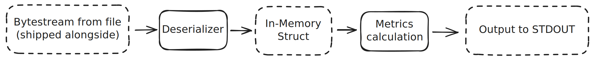
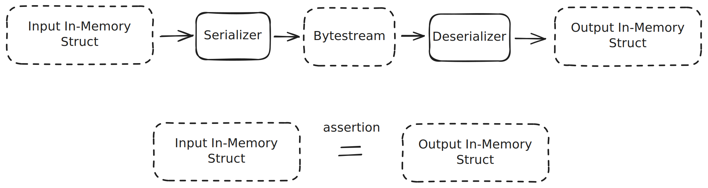

# Laboratorium 2 - Przygotowanie formatu pliku

- [Laboratorium 2 - Przygotowanie formatu pliku](#laboratorium-2---przygotowanie-formatu-pliku)
  - [Format pliku](#format-pliku)
  - [Serializator i deserializator](#serializator-i-deserializator)
  - [Reprezentacja w pamięci](#reprezentacja-w-pamięci)
  - [Struktura projektu](#struktura-projektu)
  - [Sugerowane sposoby testowania](#sugerowane-sposoby-testowania)
  - [Materiały do przeczytania](#materiały-do-przeczytania)

Celem laboratorium jest przygotowanie własnego formatu pliku, który będzie służyć do składowania danych na dysku.   

## Format pliku

Zaproponowany format powinien wspierać następujące funkcje:
* Przechowywanie dowolnej ilości kolumn
* Kolumny mają dwa dozwolone typy: 64-bitowa liczba całkowita ze znakiem oraz napis dowolnej długości (VARCHAR)
* Format pliku powinien wspierać kompresję (int64 powinien uzywac VLE oraz delta encoding, a VARCHAR kolumna ZTSD albo LZ4).
* Dane w pliku powinny być tabelaryczne (tzn. każda kolumna w pliku ma taka samą długość)

Istnieje otwarty format [Parquet](https://parquet.apache.org/docs/file-format/), który może służyć za inspirację dla własnego formatu.

## Serializator i deserializator

Zaproponowany plik powinien być wykorzystywany w tworzonym analitycznym systemie DBMS jako źródło danych do przetwarzania.
Jako początek systemu przygotuj komponent odpowiedzialny za zapis oraz odczyt przygotowanego pliku.

## Reprezentacja w pamięci

Aby móc operować na wczytanych danych (lub je zapisać do pliku) potrzebna jest reprezentacja danych w pamięci.
Przygotuj typ reprezentujący kolumnowe dane gotowe do przetwarzania.
**Przygotuj strukturę danych w taki sposób, aby procesor mógł pracować na nich najbardziej wydajnie.**

## Struktura projektu
Jest to baza do zaliczenia kolejnych projektów. Proponuję wybrać technologię, która ułatwi pracę z danymi na tak niskim poziomie oraz będzie miała do dyspozycji dobrze znaną bibliotekę do implementacji REST API.

Do zaliczenia należy przygotować program, który wczytuje plik w zadanym formacie, wykonuje deserializację oraz wyznacza dwie metryki z wczytanych danych:
* Dla każdej kolumny o typie całkowitym oblicza średnią z wartości kolumny.
* Dla każdej kolumny o typie VARCHAR wyznacza liczbę wszystkich występujących znaków ASCII.

**Proszę dostarczyć przykładowy plik zawierający 2 kolumny INT64 oraz 2 kolumny VARCHAR. Jest to warunek konieczny do sprawdzenia działania projektu zaliczeniowego.** To od teraz twój format danych.

Warto także napisać program, który wykonuje operację serializacji, aby wygenerować taki plik.

## Sugerowane sposoby testowania

Częścią kodu dobrej jakości są także jego testy. W przypadku procesu serializacji/deserializacji najłatwiej napisać testy `end-to-end`, który wykonuje obydwie operacje jednocześnie. Schemat takiego testu mozna zobaczyć na rysunku poniżej.

W takim scenariuszu oczekujemy, że dane wejściowe oraz wyjściowe będą identyczne.
Daje nam to łatwość tworzenia dowolnie złożonych danych wejściowych.
Problemem takiego podejścia jest złożoność scenariusza i trudności w znalezieniu miejsca z błędem.
Co więcej, jeżeli błąd występuje symetrycznie (w serializatorze oraz w deserializatorze) możemy zamaskować problem.

Alternatywnym i równie dobrym podejściem jest podzielenie tego procesu na pół.
Wtedy serializator oraz deserializator testuje się niezależnie od siebie.
Przy testach serializatora danymi wejściowymi jest ręcznie przygotowana struktura w pamięci, a wyjściem spodziewany strumień danych.
W przypadku deserializacji naturalnie wejściem byłby strumień, a wyjściem struktura w pamięci.

Takie testy nadają się do sprawdzania poprawności prostych przypadków (np. poprawności kodowania pojedynczej kolumny wybranego typu).

Zachęcam do implementacji obydwu typów testów, jednak typ `end-to-end` jest z reguły wystarczający, jeśli alternatywą jest brak jakichkolwiek testów. 

## Materiały do przeczytania
* [Variable length int encoding](https://en.wikipedia.org/wiki/Variable-length_quantity)
* [Delta int encoding](https://en.wikipedia.org/wiki/Delta_encoding)
* [LZ4](https://github.com/lz4/lz4)
* [ZTSD](https://github.com/facebook/zstd)
* [Parquet](https://parquet.apache.org/docs/file-format/)