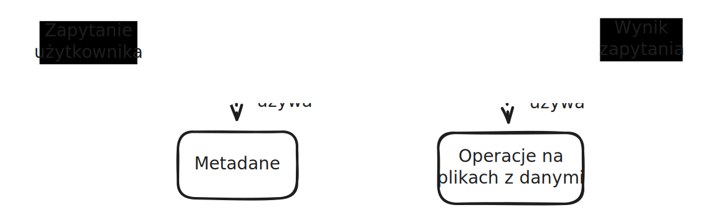

# Laboratorium 3 - Wczytywanie danych z pliku CSV

- [Laboratorium 3 - Wczytywanie danych z pliku CSV](#laboratorium-3---wczytywanie-danych-z-pliku-csv)
  - [Metastore -- logiczna struktura bazy danych](#metastore----logiczna-struktura-bazy-danych)
  - [Interfejs użytkownika](#interfejs-użytkownika)
    - [Operacje na tabelach](#operacje-na-tabelach)
    - [Wykonywanie zapytań](#wykonywanie-zapytań)
      - [Zapytanie COPY](#zapytanie-copy)
      - [Zapytanie SELECT](#zapytanie-select)
  - [Architektura aplikacji](#architektura-aplikacji)
  - [Wymagania techniczne](#wymagania-techniczne)
  - [Sugerowane sposoby testowania](#sugerowane-sposoby-testowania)
    - [Public interface testing (PIT)](#public-interface-testing-pit)
    - [Testy poszczególnych modułów](#testy-poszczególnych-modułów)
  - [Materiały do przeczytania](#materiały-do-przeczytania)

Celem laboratorium jest przygotowanie działającego systemu bazodanowego, który potrafi wczytać plik CSV i zapisać go do tabeli.
Zapis danych przedstawiających tabelę jest już zaimplementowany w projekcie nr 2.

## Metastore -- logiczna struktura bazy danych

W poprzednim projekcie przygotowana została warstwa składowania danych (potocznie zwana fizyczną).
Składa się na nią format pliku, reprezentacja danych w pamięci oraz operacja serializacji/deserializacji pomiędzy nimi.
Na tak sformatowanych danych wykonywane będą operacje analityczne.

Interfejs użytkownika w bazach danych składa się z tabel i kolumn (potocznie zwane warstwą logiczną).
**Nie ma tutaj mowy o plikach**.
Potrzeba jest więc struktura danych, która przetłumaczy abstrakty bazodanowe (tabele, widoki, indexy itp.) z warstwy logicznej na warstwę składowania danych.
Takim miejscem jest **metastore**.

Jest to struktura danych, która dostarcza wymaganych informacji do zaplanowania wykonania zapytania.
Jednym z głównych zadań planowania jest wyznaczenie listy plików do odczytania, aby uzyskać pełen zestaw danych oczekiwanych przez użytkownika.
Robione jest to na podstawie translacji logicznych nazw tabel i kolumn na odpowiednie pliki przechowujące dane.

**Wszelkie struktury danych budujące metastore powinny mieć trwałość większą niż system bazodanowy, tzn. powinny zostać zachowane pomiędzy uruchomieniami bazy danych.**
Najczęściej oznacza to, że metastore także musi zostać zapisany na dysk.

## Interfejs użytkownika

W [pliku](../../resources/dbmsInterface.yaml) można znaleźć interfejs bazy danych do wykonania w tym projekcie.
Jest to minimalny zestaw poleceń w projekcie bazy danych, który umożliwi sprawdzenie projektu.

Operacje podzielone są na dwa typy: `schema` oraz `execution`.
Poniżej można znaleźć opis operacji znajdujących się w poszczególnych grupach.

### Operacje na tabelach

Głównym endpointem tej grupy jest `/tables`, który zwraca listę wszystkich tabel w systemie.
**System powinien wyświetlać tabele stworzone przy poprzednim uruchomieniu aplikacji.**.
Na podstawie odczytanych danych można odczytać szczegóły tabeli odpytując endpoint `/table/{tableId}`.
Tam można znaleźć strukturę całej tabeli.

Dodatkowo istnieją dwa endpointy służące do tworzenia oraz usuwania tabel z systemu.

Tworzenie tabeli odbywa się poprzez wysłanie zapytania `PUT` do endpointu `/table`, w którym zostanie opisana cała struktura tabeli.
Jeżeli taką tabelę można utworzyć (ma ona unikatową nazwę oraz posiada unikatowe nazwy kolumn), zapytanie powinno zakończyć się sukcesem. Wpw. użytkownik powinien otrzymać błąd opisujący występujący problem.

Usuwanie tabeli odbywa się poprzez wysłanie zapytania `DELETE` do endpointu `/table/{tableId}`.
Jeśli tabela istnieje, powinna zostać usunięta z rejestru tabel.
Dodatkowo jej pliki będą usunięte w pewnym momencie po wykonaniu akcji.

**Obydwie operacje powinny mieć obserwowalne efekty uboczne dla zapytań następujących po wykonaniu akcji!.
Oznacza to, że aktualnie trwające zapytania nie powinny utracić dostępu do plików właśnie usuwanej tabeli.**

### Wykonywanie zapytań

Przez to, że interfejs został zaprojektowany w duchu REST, nie jest on stanowy.
Jednak nasz system ewidentnie posiada stan, ponieważ zapytania mogą trwać *pewien* czas od ich zlecenia do zakończenia.

Z tego powodu głównym endpointem jest `/queries`, który dostarcza podstawowe informacje o wykonanych zapytaniach do systemu **od jego uruchomienia**.
Na podstawie odczytanych danych można odczytać szczegóły zapytań odpytując endpoint `/query/{queryId}`.

System przewiduje dwa rodzaje zapytań: `COPY` oraz `SELECT`.

#### Zapytanie COPY

Operacja `COPY` służy do wstawiania danych z pliku w formacie CSV.
Posiada ona dwa obowiązkowe parametry: ścieżkę do wczytywanego pliku CSV oraz nazwę docelowej tabeli.

Poza tym są tam dwa dodatkowe parametry: flaga informująca, czy CSV posiada nagłówek oraz mapowanie kolumn CSV do kolumn w tabeli.
Mapowanie jest konieczne w sytuacji wstawiania danych, gdzie tabela posiada mniej kolumn niż plik CSV.
Umożliwia ono odpowiednie przekierowanie nadwyżki danych do wcześniej przygotowanej tabeli.

**Tak jak w przypadku operacji usuwania tabeli, efekt uboczny wstawiania danych ma być widoczny dopiero po całkowitym zakończeniu wstawiania danych. Niedopuszczalne są odczyty stanu pośredniego tabeli.**
Najprościej można wykonać taką operację poprzez tworzenie nowego pliku przy każdej operacji COPY i dodanie tych plików do metastore dopiero po zakończeniu całej operacji.

#### Zapytanie SELECT

Operacja `SELECT` przyjmuje nazwę tabeli i ma za zadanie pobrać wszystkie wiersze z tabeli (odpowiednik operacji `SELECT * FROM tableName;` w bazie SQL).
Jej celem jest obserwacja wstawionych danych poprzez interfejs użytkownika.
**Kolejność wierszy w zwróconych danych nie jest ustalona.**

W przypadku tego zapytania istnieje specjalny endpoint `/results/{queryId}`, który służy do pobierania wyniku po zakończeniu wykonania zapytania.
Istnieje możliwość ograniczenia zwróconych wierszy poprzez opcjonalny parametr w ciele zapytania.

## Architektura aplikacji

Od tego projektu system bazodanowy zbliża się do minimalnego poziomu złożoności, aby przedstawić ogólny zaraz procesu przetwarzania danych.
Potok wczytywania danych został przygotowany już w poprzednim projekcie.
Od tego projektu konieczne będzie podstawowe modelowanie życia zapytania.

Typowym podziałem odpowiedzialności w bazach danych jest podział na fazę planowania oraz wykonania.
Jedna faza od drugiej powinny być od siebie niezależne.
Takie podejście zwiększa izolacje problemów i ułatwia testowanie aplikacji.

## Wymagania techniczne

Poza zbudowaniem aplikacji poprzez `makefile` od tego projektu pojawia się wymaganie stworzenia podstawowego kontenera dockerowego.
Oczekuję, że dostarczony `makefile`, będzie posiadać target `docker` i w efekcie wyprodukuje obraz z bazą danych (można założyć, że użytkownik już posiada zainstalowanego dockera).

Przez to, że baza danych wymaga zależności w czasie działania, proponuję oczekiwać, że użytkownik kontenera poda volumen z zamontowanymi danymi do operacji `COPY` w ścieżce `/data` wewnątrz kontenera.

Wszystkie instrukcje uruchomienia proszę podać w pliku `README.md` projektu.

## Sugerowane sposoby testowania

Poniższy rozdział jest sugestią, jak można testować stworzony system bazodanowy.

### Public interface testing (PIT)

Naturalnym sposobem testowania bazy danych jest badanie jej stanu poprzez jej publiczny interfejs.
Takie testy pozwalają na przetestowanie systemu w sposób end-to-end w jego docelowym środowisku.
Jeśli interfejs użytkownika jest dobrze określony (tak jak to jest w naszym przypadku), testy takie można zautomatyzować za pomocą skryptów (np. `pytest` albo `bash`).

Ważnym elementów takich testów jest sprawdzenie działania systemu pomiędzy jego uruchomieniami.

### Testy poszczególnych modułów

Przy modułowej budowie oprogramowania można dzielić kod na niezależne od siebie części oraz testować te części przy ręcznie przygotowanych wejściach z innych modułów.
Na przykładzie tego projektu można wydzielić 4 elementy z [rysunku architektonicznego](#architektura-aplikacji), które można testować niezależnie od siebie.

Rozważmy testy planisty.
Typowy scenariusz testowy rozważa:
* Interfejsy potrzebne do wykonania pracy (tutaj interfejs zapytania od użytkownika, interjes wykonywania zapytań do metastore oraz format planu wykonania).
* Które interfejsy są używane jako pobieranie danych (tutaj metastore oraz zapytanie użytkownika).
* Które interfejsy są używane jako dane dla innych modułów (tutaj plan wykonania)
* Jakich gwarancji możemy spodziewać się od danych wejściowych (np. metastore zawsze zwróci nam ścieżki do istniejących plików).

Gdy znamy już wszystkie elementy, można zaproponować scenariusze testowe badające dane wyjściowe na podstawie danych wejściowych.
Znając gwarancje badanego modułu, chcemy zbadać czy przy prawidłowych danych wejściowych dane wyjściowe nadal spełniają gwarancje zapewnione przez badany moduł.
W naszym przykładzie spodziewamy się, że planista wyprodukuje plan, który można wykonać. (Jak to stwierdzić? Jest to równoważne z problemem stopu).

Takie testy są wymagające oraz wymagają dobrego rozumienia systemu.
Jednak dają one dobrą dokumentację kontraktu modułu wraz z jego gwarancjami.
Ma to znaczenie przy dużych projektach programistycznych, ponieważ modularyzacja umożliwia pisanie modułów przez różne osoby

Zachęcam do odkrywania modułów w już napisanym kodzie.
Na pewno zniechęcam do mnożenia ich ponad miarę w fazie projektowania aplikacji.
W przypadku baz danych podział potoku przetwarzania jest znany od dawna, więc można spróbować się w niego wpisać.
Jednak ostatecznie podział kodu na części i wynikające z tego interfejsy mają służyć programiście!

## Materiały do przeczytania
* [Interfejs użytkownika](../../resources/dbmsInterface.yaml)
* [Hive](https://en.wikipedia.org/wiki/Apache_Hive) - przykład rozproszonego systemu analitycznego, który posiada odrębny metastore.
* [Opis pliku CSV](https://datatracker.ietf.org/doc/html/rfc4180)